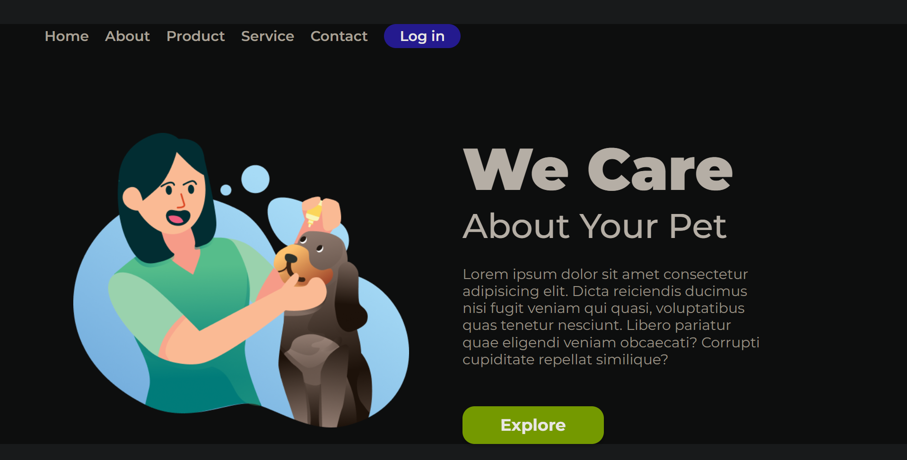

# We Care Pet — Landing Page

> Página institucional para marca de cuidados com pets, com identidade visual acolhedora, layout limpo e responsividade total em HTML5 e CSS3 puro.


🔗 **[Ver projeto online](https://luuckysilva.github.io/we-care-pet-landing-page/)**

---

## 📋 Sobre o projeto

Simulação da homepage de uma marca de cuidados pet. O foco foi construir uma interface moderna e objetiva — com navegação clara, hierarquia visual bem definida e uma proposta visual que transmite confiança e cuidado, sem depender de JavaScript.

---

## ✦ Funcionalidades

- Layout responsivo com media queries
- Estrutura semântica em HTML5
- Menu de navegação para desktop
- Hero section com CTA destacado
- Hierarquia tipográfica e espaçamento refinados
- Adaptação fluida para mobile

---

## 🖼️ Preview



> Caso a imagem não carregue, [acesse o deploy](https://luuckysilva.github.io/we-care-pet-landing-page/) diretamente.

---

## 📁 Estrutura do projeto

```
we-care-pet-landing-page/
├── assets/        # Imagens e recursos visuais
├── index.html     # Estrutura da página
└── styles.css     # Estilização completa
```

---

## 🎯 Objetivos de aprendizado

- Praticar landing pages sem dependência de frameworks
- Aprofundar responsividade com CSS puro
- Trabalhar identidade visual e paleta de cores temática
- Fortalecer organização e semântica do HTML

---

## 🚀 Melhorias futuras

- [ ] Adicionar menu mobile com toggle em JavaScript
- [ ] Criar animações de entrada nas seções
- [ ] Melhorar acessibilidade (ARIA labels, foco por teclado)
- [ ] Aplicar efeitos hover mais refinados

---

## 👨‍💻 Autor

**Lucas Silva**

[](https://www.linkedin.com/in/lucas-silva-403412a4/)
[](https://github.com/LuuckySilva)
